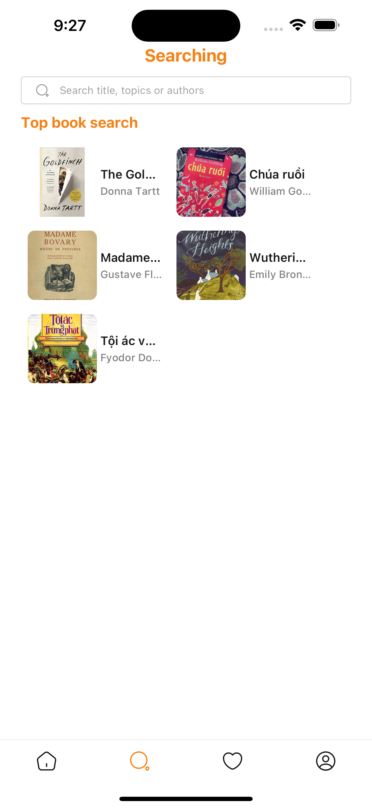
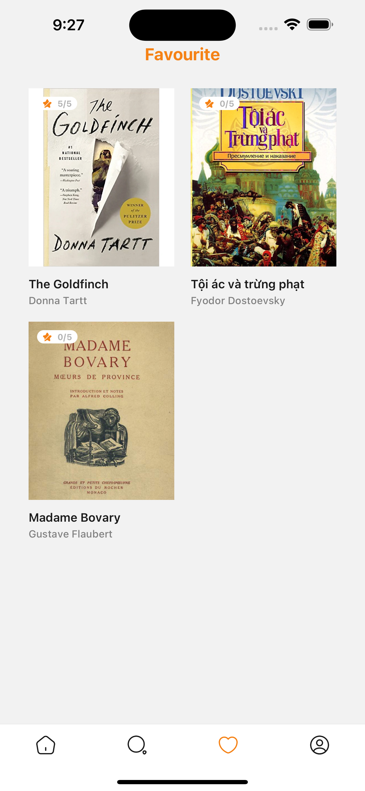

# Tabo App

## Demo App
https://drive.google.com/file/d/1rzpQzCs642v4UIQn9d2vALdfHPNu_Hme/view?usp=sharing
## Table of Contents
- [Tabo App](#tabo-app)
  - [Demo App](#demo-app)
  - [Table of Contents](#table-of-contents)
  - [About](#about)
  - [Features](#features)
  - [Screenshots](#screenshots)
  - [Getting Started](#getting-started)
    - [Prerequisites](#prerequisites)
    - [Installation](#installation)

## About

TaboApp is an application that reviews foreign literature books. The application will include a wide variety of literary books classified by genre, author, popularity, and interest level. Each book will have introductory information about the book, genre, author, ratings, number of followers, and reviews. The application inspires readers about literary books and helps them find books suitable for their needs and personal interests.

## Features
- Book
- Searching
- Wish list book
- Comment
- Rating

## Screenshots
<p float='left'>





</p>

## Getting Started

### Prerequisites

- Node.Js: https://nodejs.org/en
- Expo: https://docs.expo.dev/get-started/installation/
- Yarn: https://classic.yarnpkg.com/lang/en/docs/install/#mac-stable

### Installation

- Clone the repository to your local machine
- Install dependencies using npm or yarn
- Run the app using `yarn start` or another suitable command

```bash
git clone https://github.com/hongtam123/Tabo-App.git
cd Tabo-App
yarn
yarn start
